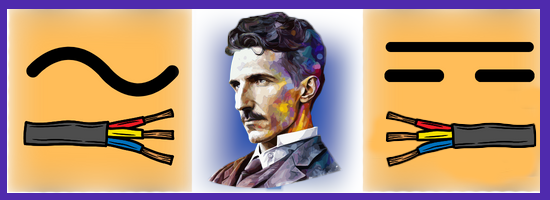

# Zamanın Gizemi: Tesla'nın Mirası

## Oyun Hikayesi

### Giriş:

Yıllar boyunca unutulmuş bir sırrın peşinde bir gazeteci olarak, sıradan bir günün ardından televizyonda Nikola Tesla'nın gizemli bir makinesinden bahsedilen bir haber izlersiniz. Haberde, Tesla'nın Colorado Springs laboratuvarında bulunan bu makinenin hala çözülemediği ve içindeki sırların ne olduğunun bilinmediği söylenir. Gazeteci, merak ve heyecan dolu, bu gizemi çözmek üzere bir karar alır.

## Ana Bölüm: Labratuvarda Bulmacalar ve Zaman Makinesi

Colorado Springs'e varışınızla birlikte, Tesla'nın laboratuvarında bir dizi zorlu bulmaca ve gizemle karşılaşırsınız. Bu bulmacaları çözmek, laboratuvarın derinliklerine inmek ve gizemli makineyi ortaya çıkarmak için çaba harcarsınız. Her bulmaca, zaman içinde çeşitli dönemlere yolculuk yapmış olan Tesla'nın ajanlarına dair ipuçlarını açığa çıkarır.

## Zirve: Zaman Makinesinin Sırları ve Ajan Ekibine Katılım

Sonunda gizemli makineyi çözersiniz ve karşınıza çıkan şey, aslında bir zaman makinesidir. Nikola Tesla'nın, zaman içinde gezinerek tarih boyunca çeşitli görevleri yerine getiren bir ajan ağı oluşturduğunu keşfedersiniz. Gazeteci, Tesla ile tanışır ve zaman içinde yolculuk yapma yeteneğine sahip bir ajan olma fırsatını yakalar.

## Katkıda Bulunanlar

- Mesut Atakan Temiz => Developer
- Halit Can Güneri => Game Designer
- Önder Kalaycı => 3D Art

## Oynanış
 <b>Haraket Et</b>

 <b>Etkilesime Gec</b>

 <b>Geri Dön</b>
